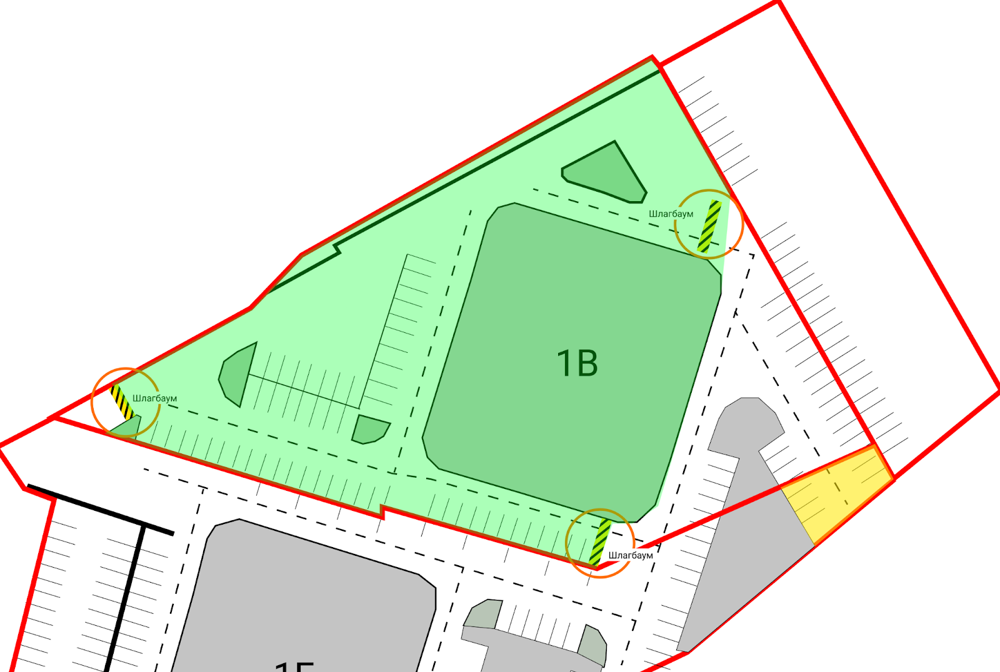

# Установка шлагбаумов в ЖК 5 Звезд

Этот документ описывает шаги, необходимые для установки шлагбаумов на территории
ЖК 5 Звезд. Текст написан по итогам ограждения первого дома и предназначен
жильцам других домов, которые тоже планируют ограждение. Вы вправе
распространять этот текст во внутренних чатах ваших домов. Делая это, давайте
ссылку на источник вместо того, чтобы просто копировать текст, потому что со
временем документ будет обновляться.

Автор: Иван Гришаев, Ворошилова 1В. +7-962-328-9677.

## Содержание

<!-- toc -->

- [Временные затраты](#%D0%B2%D1%80%D0%B5%D0%BC%D0%B5%D0%BD%D0%BD%D1%8B%D0%B5-%D0%B7%D0%B0%D1%82%D1%80%D0%B0%D1%82%D1%8B)
- [Планирование](#%D0%BF%D0%BB%D0%B0%D0%BD%D0%B8%D1%80%D0%BE%D0%B2%D0%B0%D0%BD%D0%B8%D0%B5)
- [Информирование жильцов](#%D0%B8%D0%BD%D1%84%D0%BE%D1%80%D0%BC%D0%B8%D1%80%D0%BE%D0%B2%D0%B0%D0%BD%D0%B8%D0%B5-%D0%B6%D0%B8%D0%BB%D1%8C%D1%86%D0%BE%D0%B2)
- [Подготовка документов для собрания](#%D0%BF%D0%BE%D0%B4%D0%B3%D0%BE%D1%82%D0%BE%D0%B2%D0%BA%D0%B0-%D0%B4%D0%BE%D0%BA%D1%83%D0%BC%D0%B5%D0%BD%D1%82%D0%BE%D0%B2-%D0%B4%D0%BB%D1%8F-%D1%81%D0%BE%D0%B1%D1%80%D0%B0%D0%BD%D0%B8%D1%8F)

<!-- tocstop -->

## Временные затраты

Прежде чем браться за ограждение, оцените свои силы. Практика показывает, что
процесс занимает до полугода, при этом первые три месяца вы занимаетесь этим
каждый день минимум час. Итого от вас требуется минимум сто часов. Помимо
работы, детей и семьи, без какой-либо оплаты.

Для сбора и подсчета голосов понадобится хорошее знание Excel. Пригодится умение
пользоваться электронной почтой и мессаджерами для массовой рассылки сообщений.

Вам понадобится как минимум два помощника для обхода квартир и обзвона. Эти
обязанности нельзя поручить консьержу или УК, потому что они не заинтересованы в
успехе. Важно объяснить помощникам сложность и продолжительность всего процесса
заранее. Будьте готовы к тому, что на словах все готовы помочь, но на деле
заняты: сегодня я не могу, на работе завал, заболел.

Даже если вам кажется, что жильцы воодушевлены и все проголосуют, не спешите
радоваться. Вы быстро получите 15% голосов от активных жильцов, но остальные 55%
будете выбивать тяжелым трудом.

## Планирование

Для начала продумайте места установки шлагбаумов. Вот что нужно принять во
внимание.

**Нельзя закрывать выезд с территории комплекса.** По закону у жилой территории
должно быть хотя бы два выезда для экстренных служб. Закрытие одно из них дает
повод оспорить установку шлагбаума. На текущий момент, кроме выезда на
Ворошилова и через храм, действует выезд на Бахметьева. Однако он относится к
территории Гран-при, поэтому его нельзя учитывать.

**Нельзя закрывать проезд к другим домам.** Шлагбаумы не должны мешать проезду
жителям других домов. Если житель третьего или четвертого дома не может выехать
из-за того, что пятый дом поставил ограждение, это делает установку незаконной,
даже если шлагбаумы стоят строго на территории пятого дома.

**Нельзя захватывать территорию других домов,** даже если вам кажется это
справедливым. Такая установка дает повод оспорить ее в суде (в том числе через
подставного жильца, которому все равно, но ему заплатили за жалобу).

Из двух последних пунктов следует: **лучше оградить часть территории, но
законно**, чем оградить все, но с нарушениями. Вот почему в доме 1В мы оставили
территорию перед подъездом свободной. Во-первых, ее закрытие отсекает выезд
через храм. Во-вторых, если посмотреть на карту, видно, что мы захватываем кусок
площади второго дома.

Теоретически можно провести собрание во втором доме, чтобы получить их согласие,
но это неподъемная задача.

[rosreestr]: https://pkk.rosreestr.ru/#/search/51.65458080042585,39.17951666733283/19/@5w3ttfjon?text=%D0%92%D0%BE%D1%80%D0%BE%D0%BD%D0%B5%D0%B6,%20%D1%83%D0%BB.%20%D0%92%D0%9E%D1%80%D0%BE%D1%88%D0%B8%D0%BB%D0%BE%D0%B2%D0%B0%201%D0%B2&type=1&opened=36%3A34%3A403001%3A3

Текущие кадастровые границы нашей территории вы можете посмотреть [на сайте Росреестра][rosreestr].

Если вы проводите голосование совместно с другим домом, у вас будет выбор: ждать
или не ждать их. **Совет: не ждите.** Другой дом может затянуть процесс, или вы
их задержите. И наоборот, ваш успех подстегнет их действовать. Позже, когда
ограждение будет у обоих соседних домов, вы можете убрать смежные шлагбаумы.

## Информирование жильцов

Перед выходом на голосование проведите несколько встреч с жильцами. Решите
следующие вопросы:

- кто будет главным по ограждению и кто готов помогать;
- где именно поставить шлагбаумы на территории;
- сколько их будет, какие будут с видеонаблюдением и без него;
- пригласите сотрудника фирмы и выслушайте его комментарии.

[1v-telegraph]: https://telegra.ph/Ograzhdenie-5-Zvezd-06-14

Когда эти вопросы решены, составьте описание проекта для тех жильцов, кто еще не
в курсе. В случае дома 1В документ выглядел [как этой ссылке][1v-telegraph].

После этого закиньте ссылку в чат дома, а в лифт повесьте лист А4 с краткой
версией документа и ссылкой на него через QR-код. Важно, что нужно
распространять ссылку, а не файл, потому что в случае вопросов и уточнений вы
можете поправить документ, а ссылка не изменится.

Документ пригодится вам много раз. Жильцы, далекие от темы, будут постоянно
спрашивать вас о деталях ограждения. Чтобы сэкономить свое время, отправляйте им
ссылку.

Описание проекта должно быть всегда доступно по интернету без какой-либо
регистрации. Важно, чтобы текст удобно читался на телефоне, а сверху не было
плашки "открыть в приложении". В качестве платформы для размещения подойдет
[Телеграф](https://telegra.ph), который совмещает все эти
преимущества. Единственный недостаток -- документ можно редактировать только из
того браузера, в котором он был создан.

Кроме жильцов, начните информировать коммерцию. Разместите ту же информацию на
входе в бизнес-этаж. Убедитесь, что указали телефоны для обратной связи.

## Подготовка документов для собрания

Чтобы начать голосование, нужно официально зарегистрированное собрание. Все
прошлые неофициальные встречи жильцов не считаются. Для официального собрания
потребуются следующие документы.

- [Уведомление о проведении собрания](raw/master/docs/Уведомление%20о%20проведении%20собрания.docx)

_
